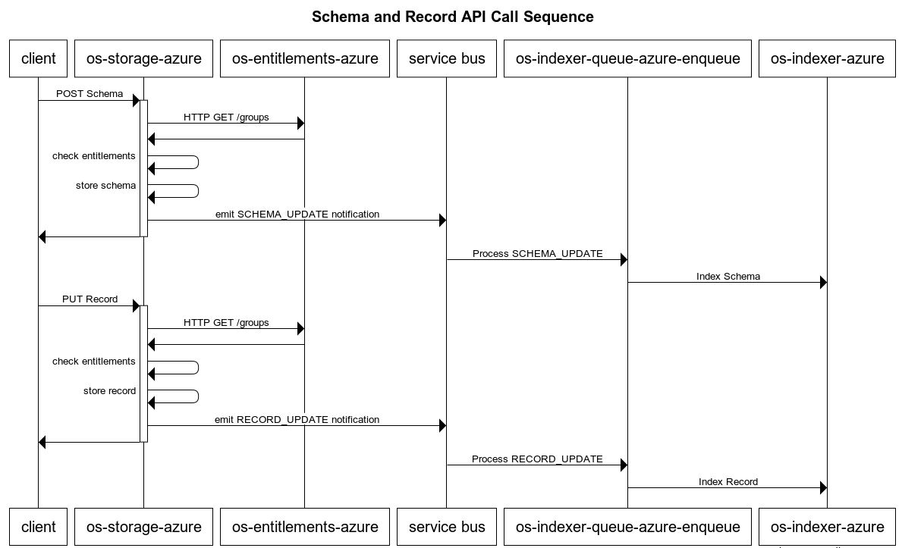

# OSDU R2 Services Overview


This session is intended to provide a broad overview of OSDU R2. The following topics are in scope:

- Introduction to OSDU R2 functional scope and use cases
- Introduction to OSDU key data types and concepts used throughout the platform
- Overview of OSDU R2 architecture in Azure
- Overview of OSDU R2 service APIs
- Overview of OSDU R2 service code structure
- Overview of OSDU R2 service testing strategy


The items in the list below are out of scope for this session:

- Deploying Infrastructure
- Running services in Locally
- Running services in Azure

## Functional scope and use cases

The following excerpt has been taken from the [OSDU Background Page](https://www.opengroup.org/membership/forums/open-subsurface-data-universe/background)

> The solution is to separate data from applications, and to standardize data and APIs with the help of an independent 
>body, The Open Group, and to involve the global cloud vendors to build working implementations that will:
> 
> - Allow companies to focus on the truly differentiating parts of business activities
> - Reduce the resource and cost burden of independently designing and validating a subsurface data platform
> - Influence and accelerate key reference components that will be the foundation of the subsurface Digital Transformation

The OSDU platform promises a flexible set of APIs that allow data owners to store, manage, index and retrieve 
(via complex queries, involving geospatial queries) metadata about schema-abiding data. The OSDU platform enables 
application developers to target a unified set of APIs on top of which they can build applications.

Developers consume the APIs to create applications that Oil and Gas companies will use. 
For example: oil field analyst businesses (there are hundreds of unique, small business in this category) 
use these APIs to create their own applications that they sell to large Oil & Gas  companies to help 
maximize how oil fields are managed. By having the OSDU APIs to build against, the small business can
afford to sell to the large and diverse operator companies.

### Useful OSDU Documentation

As you spend more time with any of the OSDU releases, you may find the following links to be useful:

- [OSDU Community GitLab](https://community.opengroup.org/osdu)
- [OSDU Glossary](https://community.opengroup.org/osdu/documentation/-/wikis/OSDU-(C)/Glossary-&-References)
- [OSDU Architecture Documentation](https://community.opengroup.org/osdu/documentation/-/wikis/Architecture)
- [OSDU Entity and Schema Documentation](https://community.opengroup.org/osdu/documentation/-/wikis/OSDU-(C)/Design-and-Implementation//Entity-and-Schemas/Demystifying-Well-Known-Schemas,-Well-Known-Entities,-Enrichment-Pipelines)
- [OSDU API Specification](https://community.opengroup.org/osdu/documentation/-/tree/master/platform%2Fapi)


## Key data types

This section discusses some key data types that will be help understand the services built in OSDU R2.

**Kind**
A *Kind* can be used to describe data of a particular *type*. Data of a particular *Kind* will all share the same *Schema*.

Example Kind identifiers include:
```
opendes:osdu:file:0.2.0
opendes:osdu:file:0.2.1
opendes:osdu:well-master:0.2.0
opendes:osdu:well-master:0.2.1
opendes:osdu:wellbore-master:0.2.0
opendes:osdu:wellbore-master:0.2.1
opendes:osdu:wellboremarker-wp:0.2.0
opendes:osdu:wellboremarker-wp:0.2.1
opendes:osdu:wellboremarker-wpc:0.2.0
opendes:osdu:wellboremarker-wpc:0.2.1
opendes:osdu:wellboretrajectory-wp:0.2.0
opendes:osdu:wellboretrajectory-wp:0.2.1
opendes:osdu:wellboretrajectory-wpc:0.2.0
opendes:osdu:wellboretrajectory-wpc:0.2.1
opendes:osdu:welllog-wp:0.2.0
opendes:osdu:welllog-wp:0.2.1
opendes:osdu:welllog-wpc:0.2.0
opendes:osdu:welllog-wpc:0.2.1
```


**Schema**
A data/metadata model expressed as JSON for a type of data, i.e. a KIND. The phrase 'standardized schema' is used to 
emphasize that all instances of a given type of data content associate with (conform with) the same schema. In other 
words, data content can be read and understood based on the associated schema.

Here's an example Schema definition. Note how it defines attributes that will be useful to consumers of the data, 
when searching for that data.

```json
{
  "kind": "opendes:osdu:well-master:0.2.0",
  "schema": [
    {
      "path": "ResourceTypeID",
      "kind": "string",
      "ext": {}
    },
    {
      "path": "ResourceID",
      "kind": "string",
      "ext": {}
    },
    {
      "path": "ResourceHomeRegionID",
      "kind": "string",
      "ext": {}
    },
    {
      "path": "ResourceHostRegionIDs",
      "kind": "[]string",
      "ext": {}
    },
    {
      "path": "ResourceObjectCreationDateTime",
      "kind": "string",
      "ext": {}
    },
    {
      "path": "ResourceVersionCreationDateTime",
      "kind": "string",
      "ext": {}
    },
    {
      "path": "ResourceCurationStatus",
      "kind": "string",
      "ext": {}
    },
    {
      "path": "ResourceLifecycleStatus",
      "kind": "string",
      "ext": {}
    },
    {
      "path": "ResourceSecurityClassification",
      "kind": "string",
      "ext": {}
    },
    {
      "path": "Data.IndividualTypeProperties.FacilityID",
      "kind": "string",
      "ext": {}
    },
    {
      "path": "Data.IndividualTypeProperties.FacilityTypeID",
      "kind": "string",
      "ext": {}
    },
    {
      "path": "Data.IndividualTypeProperties.FacilityOperator.FacilityOperatorOrganisationID",
      "kind": "string",
      "ext": {}
    },
    {
      "path": "Data.IndividualTypeProperties.FacilityOperator.EffectiveDateTime",
      "kind": "string",
      "ext": {}
    },
    {
      "path": "Data.IndividualTypeProperties.FacilityOperator.TerminationDateTime",
      "kind": "string",
      "ext": {}
    },
    {
      "path": "Data.IndividualTypeProperties.DataSourceOrganisationID",
      "kind": "string",
      "ext": {}
    },
    {
      "path": "Data.IndividualTypeProperties.SpatialLocation.SpatialLocationCoordinatesDate",
      "kind": "string",
      "ext": {}
    },
    {
      "path": "Data.IndividualTypeProperties.SpatialLocation.QuantitativeAccuracyBandID",
      "kind": "string",
      "ext": {}
    },
    {
      "path": "Data.IndividualTypeProperties.SpatialLocation.QualitativeSpatialAccuracyTypeID",
      "kind": "string",
      "ext": {}
    },
    {
      "path": "Data.IndividualTypeProperties.SpatialLocation.CoordinateQualityCheckPerformedBy",
      "kind": "string",
      "ext": {}
    },
    {
      "path": "Data.IndividualTypeProperties.SpatialLocation.CoordinateQualityCheckDateTime",
      "kind": "string",
      "ext": {}
    },
    {
      "path": "Data.IndividualTypeProperties.SpatialLocation.CoordinateQualityCheckRemark",
      "kind": "string",
      "ext": {}
    },
    {
      "path": "Data.IndividualTypeProperties.SpatialLocation.Coordinates.x",
      "kind": "double",
      "ext": {}
    },
    {
      "path": "Data.IndividualTypeProperties.SpatialLocation.Coordinates.y",
      "kind": "double",
      "ext": {}
    },
    {
      "path": "Data.IndividualTypeProperties.SpatialLocation.SpatialParameterTypeID",
      "kind": "string",
      "ext": {}
    },
    {
      "path": "Data.IndividualTypeProperties.SpatialLocation.SpatialGeometryTypeID",
      "kind": "string",
      "ext": {}
    },
    {
      "path": "Data.IndividualTypeProperties.SpatialLocation.VerticalCRSID",
      "kind": "string",
      "ext": {}
    },
    {
      "path": "Data.IndividualTypeProperties.SpatialLocation.HorizontalCRSID",
      "kind": "string",
      "ext": {}
    },
    {
      "path": "Data.IndividualTypeProperties.SpatialLocation.Elevation",
      "kind": "double",
      "ext": {}
    },
    {
      "path": "Data.IndividualTypeProperties.SpatialLocation.HeightAboveGroundLevel",
      "kind": "double",
      "ext": {}
    },
    {
      "path": "Data.IndividualTypeProperties.SpatialLocation.HeightAboveGroundLevelUOMID",
      "kind": "string",
      "ext": {}
    },
    {
      "path": "Data.IndividualTypeProperties.FacilityName",
      "kind": "string",
      "ext": {}
    },
    {
      "path": "Data.IndividualTypeProperties.FacilityNameAlias.AliasName",
      "kind": "string",
      "ext": {}
    },
    {
      "path": "Data.IndividualTypeProperties.FacilityNameAlias.AliasNameTypeID",
      "kind": "string",
      "ext": {}
    },
    {
      "path": "Data.IndividualTypeProperties.FacilityNameAlias.DefinitionOrganisationID",
      "kind": "string",
      "ext": {}
    },
    {
      "path": "Data.IndividualTypeProperties.FacilityNameAlias.EffectiveDateTime",
      "kind": "string",
      "ext": {}
    },
    {
      "path": "Data.IndividualTypeProperties.FacilityNameAlias.TerminationDateTime",
      "kind": "string",
      "ext": {}
    },
    {
      "path": "Data.IndividualTypeProperties.FacilityState.EffectiveDateTime",
      "kind": "string",
      "ext": {}
    },
    {
      "path": "Data.IndividualTypeProperties.FacilityState.TerminationDateTime",
      "kind": "string",
      "ext": {}
    },
    {
      "path": "Data.IndividualTypeProperties.FacilityState.FacilityStateTypeID",
      "kind": "string",
      "ext": {}
    },
    {
      "path": "Data.IndividualTypeProperties.FacilityEvent.FacilityEventTypeID",
      "kind": "string",
      "ext": {}
    },
    {
      "path": "Data.IndividualTypeProperties.FacilityEvent.EffectiveDateTime",
      "kind": "string",
      "ext": {}
    },
    {
      "path": "Data.IndividualTypeProperties.FacilityEvent.TerminationDateTime",
      "kind": "string",
      "ext": {}
    },
    {
      "path": "Data.IndividualTypeProperties.FacilitySpecification.EffectiveDateTime",
      "kind": "string",
      "ext": {}
    },
    {
      "path": "Data.IndividualTypeProperties.FacilitySpecification.TerminationDateTime",
      "kind": "string",
      "ext": {}
    },
    {
      "path": "Data.IndividualTypeProperties.FacilitySpecification.FacilitySpecificationQuantity",
      "kind": "int",
      "ext": {}
    },
    {
      "path": "Data.IndividualTypeProperties.FacilitySpecification.FacilitySpecificationDateTime",
      "kind": "string",
      "ext": {}
    },
    {
      "path": "Data.IndividualTypeProperties.FacilitySpecification.FacilitySpecificationIndicator",
      "kind": "boolean",
      "ext": {}
    },
    {
      "path": "Data.IndividualTypeProperties.FacilitySpecification.FacilitySpecificationText",
      "kind": "string",
      "ext": {}
    },
    {
      "path": "Data.IndividualTypeProperties.FacilitySpecification.UnitOfMeasureID",
      "kind": "string",
      "ext": {}
    },
    {
      "path": "Data.IndividualTypeProperties.FacilitySpecification.ParameterTypeID",
      "kind": "string",
      "ext": {}
    },
    {
      "path": "Data.IndividualTypeProperties.DefaultVerticalMeasurementID",
      "kind": "string",
      "ext": {}
    },
    {
      "path": "Data.IndividualTypeProperties.DefaultVerticalCRSID",
      "kind": "string",
      "ext": {}
    },
    {
      "path": "Data.IndividualTypeProperties.VerticalMeasurements.VerticalMeasurementID",
      "kind": "string",
      "ext": {}
    },
    {
      "path": "Data.IndividualTypeProperties.VerticalMeasurements.EffectiveDateTime",
      "kind": "string",
      "ext": {}
    },
    {
      "path": "Data.IndividualTypeProperties.VerticalMeasurements.VerticalMeasurement",
      "kind": "double",
      "ext": {}
    },
    {
      "path": "Data.IndividualTypeProperties.VerticalMeasurements.TerminationDateTime",
      "kind": "string",
      "ext": {}
    },
    {
      "path": "Data.IndividualTypeProperties.VerticalMeasurements.VerticalMeasurementTypeID",
      "kind": "string",
      "ext": {}
    },
    {
      "path": "Data.IndividualTypeProperties.VerticalMeasurements.VerticalMeasurementPathID",
      "kind": "string",
      "ext": {}
    },
    {
      "path": "Data.IndividualTypeProperties.VerticalMeasurements.VerticalMeasurementSourceID",
      "kind": "string",
      "ext": {}
    },
    {
      "path": "Data.IndividualTypeProperties.VerticalMeasurements.WellboreTVDTrajectoryID",
      "kind": "string",
      "ext": {}
    },
    {
      "path": "Data.IndividualTypeProperties.VerticalMeasurements.VerticalMeasurementUnitOfMeasureID",
      "kind": "string",
      "ext": {}
    },
    {
      "path": "Data.IndividualTypeProperties.VerticalMeasurements.VerticalCRSID",
      "kind": "string",
      "ext": {}
    },
    {
      "path": "Data.IndividualTypeProperties.VerticalMeasurements.VerticalReferenceID",
      "kind": "string",
      "ext": {}
    },
    {
      "path": "Data.IndividualTypeProperties.VerticalMeasurements.VerticalMeasurementDescription",
      "kind": "string",
      "ext": {}
    },
    {
      "path": "Data.IndividualTypeProperties.InterestTypeID",
      "kind": "string",
      "ext": {}
    },
    {
      "path": "Data.IndividualTypeProperties.OperatingEnvironmentID",
      "kind": "string",
      "ext": {}
    },
    {
      "path": "Data.IndividualTypeProperties.CountryID",
      "kind": "string",
      "ext": {}
    },
    {
      "path": "Data.IndividualTypeProperties.StateProvinceID",
      "kind": "string",
      "ext": {}
    },
    {
      "path": "Data.IndividualTypeProperties.QuadrantID",
      "kind": "string",
      "ext": {}
    },
    {
      "path": "Data.IndividualTypeProperties.BlockID",
      "kind": "string",
      "ext": {}
    },
    {
      "path": "Data.IndividualTypeProperties.CountyID",
      "kind": "string",
      "ext": {}
    },
    {
      "path": "Data.IndividualTypeProperties.BasinID",
      "kind": "string",
      "ext": {}
    }
  ]
}
```

**Legal Tag**
A LegalTag is the entity that represents the legal status of data in the Data Ecosystem. It is a collection of 
properties that governs how the data can be consumed and ingested.

Here's a definition of a Legal Tag. Its name will be used by other data and APIs.

```json
{
  "name": "public-usa-dataset-1",
  "description": "A legaltag used for demonstration purposes.",
  "properties": {
    "countryOfOrigin": [
      "US"
    ],
    "contractId": "No Contract Related",
    "expirationDate": "2099-01-01",
    "originator": "SLB",
    "dataType": "Public Domain Data",
    "securityClassification": "Public",
    "personalData": "No Personal Data",
    "exportClassification": "Not - Technical Data"
  }
}
```

**Access Control Lists (ACL)**
Access Control Lists define which groups are allowed to perform operations on *Records*. ACLs are split 
into `viewers` and `owners`.

Here are some examples of entitlements granted to users.

```
data.datalake.viewer
data.default.owners
data.default.viewer
service.entitlements.admin
service.legal.admin
service.search.admin
service.search.user
service.storage.admin
```

Note: we've seen some confusion around ACLs with the terms "viewer" vs. "viewers". 
As of this writing, the singular form of these terms seems to be preferred.

**Data**
*Data* in OSDU is what is stored and indexed within the platform. Typically this data will include metadata about well 
logs and seismic records. An example of `data` is shown in the `Record`, below.

This can be confusing. Let's dive into this a little more. Consider that a lot of detail is captured about an oil or gas well. 
Some of it is called 'metadata' and some is just called 'data'.
Regardless, it is all captured somewhere, and much of the OSDU R2 APIs are designed to help people _find_ the data they
might find helpful, and to prevent people from discovering or reaching data that they are not entitled to.

The data that is relevant here is most usually _metadata_. Think: depth, country, lat/long, owner, etc.

The data that represents discrete measurements are only pointed to here. Not indexed or searchable. That sort of data
might be precise temperature and alkalinity measurements of a well bore over its length, or well production information
about yield over time and the nature of the product recovered from the well, or perhaps the massive seismic readings
that help geologists map out oil fields. All of these sorts of data are not indexed, here, but the record that _are_ indexed
might point to that _base data_.

**Record**
A [record](https://community.opengroup.org/osdu/documentation/-/wikis/OSDU-(C)/Design-and-Implementation/Entity-and-Schemas/Record-Structure-(OLD)) 
combines the following elements - or references to the following elements - into one document that can be stored, 
retrieved, indexed and queried using OSDU R2 services:
 - *Kind*
 - *Schema*
 - *Legal Tag*
 - *Access Control List*
 - *Data*

Here's an example json payload that represents a typical Record:
```json
{
    "ResourceTypeID": "srn:type:master-data/Well:",
    "Manifest": {
        "ResourceID": "srn:master-data/Well:1000:",
        "ResourceTypeID": "srn:type:master-data/Well:",
        "ResourceSecurityClassification": "srn:reference-data/ResourceSecurityClassification:RESTRICTED:",
        "Data": {
            "IndividualTypeProperties": {
                "FacilityOperator": [
                    {
                        "FacilityOperatorOrganisationID": "srn:master-data/Organisation:ROVD:"
                    }
                ],
                "DataSourceOrganisationID": "srn:master-data/Organisation:TNO:",
                "SpatialLocation": [
                    {
                        "Coordinates": [
                            {
                                "x": 5.98136045,
                                "y": 51.43503877
                            }
                        ],
                        "SpatialGeometryTypeID": "srn:reference-data/SpatialGeometryType:Point:",
                        "VerticalCRSID": "srn:reference-data/VerticalCRS:NAP:",
                        "HorizontalCRSID": "srn:reference-data/HorizontalCRS:WGS84:",
                        "HeightAboveGroundLevelUOMID": "srn:reference-data/UnitOfMeasure:M:"
                    }
                ],
                "FacilityName": "ACA-11",
                "FacilityNameAlias": [
                    {
                        "AliasName": "ACA-11",
                        "AliasNameTypeID": "srn:reference-data/AliasNameType:Name:"
                    },
                    {
                        "AliasName": "1000",
                        "AliasNameTypeID": "srn:reference-data/AliasNameType:UWI:"
                    }
                ],
                "FacilityState": [
                    {
                        "FacilityStateTypeID": "srn:reference-data/FacilityStateType:Abandoned:"
                    }
                ],
                "FacilityEvent": [
                    {
                        "FacilityEventTypeID": "srn:reference-data/FacilityEventType:SPUD:",
                        "EffectiveDateTime": "1909-04-05T00:00:00"
                    },
                    {
                        "FacilityEventTypeID": "srn:reference-data/FacilityEventType:DRILLING FINISH:",
                        "EffectiveDateTime": "1910-01-19T00:00:00"
                    }
                ],
                "DefaultVerticalMeasurementID": "Rotary Table",
                "VerticalMeasurements": [
                    {
                        "VerticalMeasurementID": "Rotary Table",
                        "VerticalMeasurementTypeID": "srn:reference-data/VerticalMeasurementType:Rotary Table:",
                        "VerticalMeasurement": 29.3,
                        "VerticalMeasurementPathID": "srn:reference-data/VerticalMeasurementPath:Elevation:",
                        "VerticalMeasurementUnitOfMeasureID": "srn:reference-data/UnitOfMeasure:M:",
                        "VerticalCRSID": "srn:reference-data/VerticalCRS:NAP:"
                    }
                ],
                "OperatingEnvironmentID": "srn:reference-data/WellOperatingEnvironment:ON:",
                "CountryID": "srn:master-data/GeopoliticalEntity:Netherlands:",
                "StateProvinceID": "srn:master-data/GeopoliticalEntity:Limburg:",
                "QuadrantID": "srn:master-data/GeopoliticalEntity:L:"
            }
        }
    }
}
```


## Key Concepts

**Entitlement**

Clients of OSDU will prove their identity by providing a [JWT Token](https://en.wikipedia.org/wiki/JSON_Web_Token) with 
each HTTP request through the form of the `data-partition-id` header. This token should be acquired by the client using
the [Open ID Connect 2.0](https://docs.microsoft.com/en-us/azure/active-directory/azuread-dev/v1-protocols-openid-connect-code)
protocol. This token allows the services to assert the caller's identity. That identity has a number of entitlements, 
which are used authorize access to service endpoints and row level records.

More specifically, entitlements are used to:

- Grant or deny access to APIs for OSDU R2 services. The authorization model allows these permissions to be granted 
on a per API basis
- Grant or deny access to data rows. The authorization model enables this by leveraging the *Access Control Lists* 
within a *Record*

**OSDU Tenant**

OSDU is intended to be a *multi-tenant* platform. That means that data for multiple customers may be managed by the 
same deployment. In order to ensure that data belonging to a specific tenant is not "leaked" to users in other tenants, 
services must model entitlements on a per-tenant basis. Data within OSDU is partitioned using the *OSDU Tenant*, or 
*Tenant* for short. HTTP Requests against *OSDU Tenants* often contain an HTTP header (`data-partition-id`) that 
corresponds with the *OSDU Tenant* for which data is being requested.

Note: A common pitfall is to mistake the *Azure Tenant* with the *OSDU Tenant*.

## Q & A

## Architecture in Azure

The OSDU R2 Azure implementation depends on the following cloud resources:

- Azure App Services
- Azure Functions
- CosmosDB
- KeyVault
- Service Bus
- Elasticsearch

The latest documentation for the infrastructure that powers this solution can be read about, in detail, [here](https://dev.azure.com/slb-des-ext-collaboration/open-data-ecosystem/_git/infrastructure-templates?path=%2Finfra%2Ftemplates%2Faz-micro-svc-small-elastic-cloud%2FREADME.md&_a=preview). Deployments of this infrastructure are configurable and can be deployed easily. However, this will be covered in a future handoff session.

## Service APIs

The following tables describe a **subset** of the APIs exposed by each service in OSDU R2. The goal is to give a 
general overview of the functionality provided by the services without fully documenting them.

**os-entitlements-azure**

| API | HTTP Verb | Description |
| --- | ---       | ---         |
| `/groups` | GET | Return the groups for the user identified by the JWT token |

**os-legal-azure**

| API | HTTP Verb | Description |
| --- | ---       | ---         |
| `legaltags` | POST | Create a legal tag |
| `/legaltags/{name}` | GET | Get a legal tag by name |

**os-storage-azure**

| API | HTTP Verb | Description |
| --- | ---       | ---         |
| `/schemas` | POST | Create a schema |
| `/schemas/{kind}` | GET | Get a schema for the specified Kind |
| `/records/` | PUT | Add a new record |
| `/records/{id}` | GET | Get the latest version of a record |

**os-indexer-queue-azure-enqueue**

`os-indexer-queue-azure-enqueue` is an Azure Function invoked as a result of messages being published onto Service Bus 
topics. These messages are emitted by `os-storage-azure` in response to *Records* or *Schemas* being created or updated
and are used to trigger data indexing via the `os-indexer-azure` service.

**os-indexer-azure**

| API | HTTP Verb | Description |
| --- | ---       | ---         |
| `/_dps/task-handlers/index-worker` | POST | Index a record. Only called by `os-indexer-queue-azure-enqueue` |

**os-search-azure**

| API | HTTP Verb | Description |
| --- | ---       | ---         |
| `/query` | POST | Query records and schemas. Elasticsearch syntax is used |


### API call patterns for common operations

**Create Schema and Record**

```plantuml
<!--
Can be replicated by pasting the following sequence into
https://www.websequencediagrams.com/

title Schema and Record API Call Sequence

client -> os-storage-azure:POST Schema
activate os-storage-azure
os-storage-azure->os-entitlements-azure: HTTP GET /groups
os-entitlements-azure->os-storage-azure:
os-storage-azure -> os-storage-azure: check entitlements
os-storage-azure -> os-storage-azure: store schema
os-storage-azure -> service bus: emit SCHEMA_UPDATE notification
os-storage-azure -> client:
deactivate os-storage-azure

service bus -> os-indexer-queue-azure-enqueue: Process SCHEMA_UPDATE
os-indexer-queue-azure-enqueue -> os-indexer-azure: Index Schema

client -> os-storage-azure:PUT Record
activate os-storage-azure
os-storage-azure->os-entitlements-azure: HTTP GET /groups
os-entitlements-azure->os-storage-azure:
os-storage-azure -> os-storage-azure: check entitlements
os-storage-azure -> os-storage-azure: store record
os-storage-azure -> service bus: emit RECORD_UPDATE notification
os-storage-azure -> client:
deactivate os-storage-azure

service bus -> os-indexer-queue-azure-enqueue: Process RECORD_UPDATE
os-indexer-queue-azure-enqueue -> os-indexer-azure: Index Record
-->
```



### Q & A

## Service code structure

The following section outlines the structure of the service code. All OSDU R2 services are written as Java [Spring Boot](https://spring.io/projects/spring-boot) services. They build using [Apache Maven](https://maven.apache.org/).

### Cloud Agnostic Services

In order to support a multi-cloud deployment, Schlumberger has modeled the following OSDU R2 services using the 
following pattern. Assuming a service with name `$SERVICE`, you will expect to find a repository structure that 
looks roughly like so:

```bash
$ tree -L 2 "os-$SERVICE"
os-$SERVICE
├── azure-pipelines.yml         # non-azure build
├── maven
│   └── settings.xml            # maven configuration
├── devops
│   └── service-pipeline.yml    # azure build and release definition (standardized across services)
├── provider                    # cloud provider implementations
│   ├── $SERVICE-aws
│   ├── $SERVICE-azure          # azure implementation
│   ├── $SERVICE-byoc
│   ├── $SERVICE-gcp
│   └── $SERVICE-ibm
├── pom.xml                     # project POM
├── $SERVICE-core               # core business logic
│   ├── maven
│   ├── pom.xml                 # core project POM
│   └── src
└── testing                     # testing root
    ├── maven
    ├── $SERVICE-test-aws
    ├── $SERVICE-test-azure     # azure testing implementation
    ├── $SERVICE-test-core      # testing core
    ├── $SERVICE-test-gcp
    └── $SERVICE-test-ibm
```

You will see a lot of `pom.xml` files. Here is a guide to understanding them:

| POM location | Category | Description | Dependencies |
| ---          | ---      | ---         | ---          |
| `os-$SERVICE/pom.xml` | Service | Build and unit test core (cloud agnostic) service along with each of the cloud 
specific implementations | None |
| `os-$SERVICE/$SERVICE-core/pom.xml` | Service | Build and unit test core service | None |
| `provider/$SERVICE-$PROVIDER/pom.xml` | Service | Build and unit test cloud specific implementation | `mvn install os-$SERVICE/$SERVICE-core/pom.xml` must be run first |
| `os-$SERVICE/testing/$SERVICE-test-core/pom.xml` | Test | Build and unit test core (cloud agnostic) tests | None |
| `os-$SERVICE/testing/$SERVICE-test-$PROVIDER/pom.xml` | Test | Build and unit test cloud specific implementation tests | `mvn install os-$SERVICE/testing/$SERVICE-test-core/pom.xml` must be run first |

#### Core code vs Provider code

The core service code is located under `os-$SERVICE/$SERVICE-core/`. This package will build as its own java package. 
The *Provider* implementations depend on the *Core* implementation. The *Provider* implementations will implement the 
cloud-specific logic in the `provider/$SERVICE-$PROVIDER` directory.

#### Service Provider Interface (SPI)

The strategy that Schlumberger has chosen to enable the OSDU R2 platform to run on multiple clouds is to "hide" the 
implementation details of key functional components in a **Service Provider Interface (SPI)**. As an example, here is 
a condensed *SPI* pulled from `os-storage-core`:

```java
public interface ICloudStorage {
	void write(RecordProcessing... recordsProcessing);
	String read(RecordMetadata record, Long version, boolean checkDataInconsistency);
}
```

Each of the cloud providers will need to implement all SPIs defined by a service under the appropriate 
`provider/$SERVICE-$PROVIDER` directory. When the application boots up, the provider implementation is injected into 
the core service runtime using [Spring](https://spring.io/) for dependency injection.

#### Testing Strategy

The integration tests for each service leverage the same pattern of Dependency Injection to achieve cloud-native 
integration tests. Each of the Spring based service has a battery of integration tests that run on each release.

### Cloud Specific Services

While most of the OSDU R2 services are written using the cloud-native strategy outlined above, there are two 
notable exceptions.

- `os-entitlements-azure`
- `os-indexer-queue-azure-enqueue`

Keep this in mind when trying to run the services locally and in Azure. Subsequent sessions will walk through 
this in more detail.

### Q & A

## License
Copyright © Microsoft Corporation
Licensed under the Apache License, Version 2.0 (the "License");
you may not use this file except in compliance with the License.
You may obtain a copy of the License at 
[http://www.apache.org/licenses/LICENSE-2.0](http://www.apache.org/licenses/LICENSE-2.0)
Unless required by applicable law or agreed to in writing, software
distributed under the License is distributed on an "AS IS" BASIS,
WITHOUT WARRANTIES OR CONDITIONS OF ANY KIND, either express or implied.
See the License for the specific language governing permissions and
limitations under the License.
