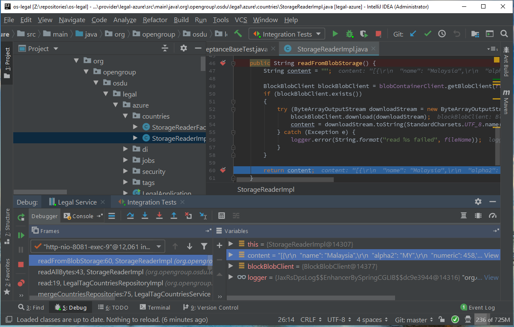

# Introduction

The purpose of this guide is to:
 - enable developers install & set-up the tooling required to build and run the OSDU R2 services locally
 - run two OSDU R2 services [os-entitlements-azure](https://dev.azure.com/slb-des-ext-collaboration/open-data-ecosystem/_git/os-entitlements-azure) and [os-legal-azure](https://dev.azure.com/slb-des-ext-collaboration/open-data-ecosystem/_git/os-legal) with integration tests passing
 - deep dive into the code structure of such services

This guide assumes that the reader has:
 - experience with [Git](https://git-scm.com/downloads)
 - access to the Azure DevOps project [here](https://dev.azure.com/slb-des-ext-collaboration/open-data-ecosystem/)
 - generated a Personal Access Token (PAT) from Azure DevOps. See instructions [here](https://docs.microsoft.com/en-us/azure/devops/organizations/accounts/use-personal-access-tokens-to-authenticate?view=azure-devops&tabs=preview-page).
 - experience with [Java Spring Boot](https://spring.io/projects/spring-boot)

 This guide will utilize the software and versions below:
 - [AdoptOpenJDK8](https://adoptopenjdk.net/) – jdk-8.0.12.04-hotspot
 - [Maven](https://maven.apache.org/download.cgi) – 3.6.0
 - [IntelliJ IDEA](https://www.jetbrains.com/idea/) - Community Edition – 2019.1.4

> Note: Just getting started with local service development? You may want to read through the [Getting Started](./04_LOCAL_SERVICE_DEVELOPMENT_GETTING_STARTED.md) document first!

## Local Developer Tooling Set-Up

### Install OpenJDK
- Navigate to [https://adoptopenjdk.net/](https://adoptopenjdk.net/) and follow instructions for installing OpenJDK 1.8. The version used in this guide is `0.12.04-hotspot`, but any version of OpenJDK 1.8 is OK.
- Verify that the JDK version is installed by running “java -version” in the console and seeing output such as
```plantuml
openjdk version "1.8.0_212"
OpenJDK Runtime Environment (AdoptOpenJDK)(build 1.8.0_212-b04)
OpenJDK 64-Bit Server VM (AdoptOpenJDK)(build 25.212-b04, mixed mode)
```
### Install Maven
- Navigate to [http://maven.apache.org/install.html)](http://maven.apache.org/install.html) and follow instructions for installing Maven 3.6.0 or newer.
- Verify that Maven is installed by running **mvn -version** in the console and seeing an output such as
```plantuml
Apache Maven 3.6.0 (97c98ec64a1fdfee7767ce5ffb20918da4f719f3; 2018-10-24T18:41:47Z)
Maven home: C:\apache-maven-3.6.0\bin\..
Java version: 1.8.0_212, vendor: AdoptOpenJDK, runtime: C:\Program Files\AdoptOpenJDK\jdk-8.0.212.04-hotspot\jre
Default locale: en_US, platform encoding: Cp1252
OS name: "windows 10", version: "10.0", arch: "amd64", family: "windows"
```
### Install IntelliJ
- Navigate to [https://www.jetbrains.com/idea/download/other.html](https://www.jetbrains.com/idea/download/other.html) and follow the installation instructions for downloading the IntelliJ IDE Community Edition 2019.1.4 or newer.
- Run IntelliJ to verify that the installation was successful.

### Install Plugins for IntelliJ
- Locate the plugins configuration in IntelliJ (Configure --> Plugins)
- Search the marketplace for the [Azure DevOps](https://plugins.jetbrains.com/plugin/7981-azure-devops) and [EnvFile](https://plugins.jetbrains.com/plugin/7861-envfile) plugins, select each one and install.

Azure DevOps allows IntelliJ to seamlessly integrate with Azure DevOps projects. Version used in this guide is v1.158.0. Note: may no longer be useful after project is migrated to GitLab.

EnvFile allows IntelliJ's Application Jar or Junit configurations to leverage a file with environment variables. Version used in this guide is v.3.2.0

### Configure the user settings file in IntelliJ
- Navigate to the .m2 folder. Typically, this is under `C:\Users\{username}\.m2` in Windows or `$HOME/.m2/settings.xml` on UNIX based systems
- Create a new settings.xml file. Add the following to the file and insert you PAT token
```plantuml
<settings>
  <servers>
        <server>
            <id>os-core</id>
            <username>slb-des-ext-collaboration</username>
            <password>{INSERT PAT TOKEN HERE}</password>
        </server>
  </servers>
</settings>
```

Now that the foundation software is installed, proceed to running the services.

##Run os-entitlements-azure

### Clone the repo
- Clone from command line with Git or leverage the Azure DevOps plugin in IntelliJ.

### Import project in IntelliJ
- Select the local directory where the repo was clone to
- Select **Maven** when prompted to `import project from external model`. Hit next.
- Tick the **Search for project recursively** and **import Maven projects automatically** checkboxes. Make sure the `JDK for Importer` is selected as ** Internal JRE (java version “1.8.0_212-b4)** (see Import screenshot below). Hit Next.
- Make sure all checkboxes are ticked when prompted to select which projects to import. Hit Next.
- Make sure the 1.8 SDK is selected. If it’s not already selected, add it using the **+** button. The JDK home path is `C:\Program Files\AdoptOpenJDK\jdk-8.0.212.04-hotspot` on Windows or `/usr/lib/jvm/jdk8u212-b04/` on UNIX based systems. Hit Next.
- Verify that the project name is os-entitlements-azure and the project file location is the desired one. Hit Finish.
- Wait until IntelliJ resolves dependencies and indexes the project files. (see finished import screenshot below)
- Navigate the project structure in the Project pane.

Import project


Finished importing project


### Build JAR
- Select the terminal window in IntelliJ
- Change directory to where you cloned the repo such as `C:\Users\developer\os-entitlements-azure` (if it’s not there already).
- Run the `mvn clean install` command
- Verify that the build succeeded by navigating to project root --> target and verify that `entitlements-$VERSION-SNAPSHOT.jar` (where `$VERSION` is the current version of the project) exists.

Once the JAR builds successfully, the next step is to create an EnvFile that IntelliJ will use for environmental variables during the run configuration.

### Create EnvFile for running the JAR
- Check the service [readme file](https://dev.azure.com/slb-des-ext-collaboration/open-data-ecosystem/_git/os-entitlements-azure?path=%2FREADME.md&_a=preview) for the most up-to-date properties required to run the service.
- Create a new env file such as os-entitlements-azure.integration.env and populate the values with those of your deployment/tenant/configuration. You may also refer to the KeyVault resource which holds the secrets.
- Save the file

### Create Run configuration in IntelliJ
- Bring up the Run/Debug Configuration pane by going to Run --> Edit Configurations in IntelliJ
- Add a new JAR Application configuration (see screenshot below)
    - Name it
    - Select the Path to JAR to be the path of the JAR that was built in the previous step
    - Enable EnvFile under the EnvFile tab, add the .env file was create in the previous step (see screenshot below)
- Click Apply.

Run Configuration


Run Configuration EnvFile


### Run JAR in IntelliJ
- Select the run configuration created in the previous step
- Click the Debug button or press Shift+F9
- Verify that the Debug console says something such as `Started EntitlementsApplication in 16.406 seconds (JVM running for 18.802)` (ignore the seconds as these vary by system).
- After the service has started it should be accessible via a web browser by visiting [http://localhost:8080/swagger-ui.html](http://localhost:8080/swagger-ui.html). If the request does not fail, you can then run the integration tests.

### Create EnvFile for the integration tests
- Check the service [readme file](https://dev.azure.com/slb-des-ext-collaboration/open-data-ecosystem/_git/os-entitlements-azure?path=%2FREADME.md&_a=preview) for the most up-to-date properties required to run the integration tests.
- Create a new env file such as os-entitlements-azure.integration.env and populate the values with those of your deployment/tenant/configuration. You may also refer to the Keyvault resource which holds the secrets.
- Save the file.

### Create Integration Tests configuration in IntelliJ
- Bring up the Run/Debug Configuration pane by going to Run --> Edit Configurations in IntelliJ
- Add a new JUnit configuration (see screenshot below)
    - Name it
    - Select the **All in package** for `Test Kind`
    - Select **In single module** for `Search for tests`
    - Select **entitlements-test-azure** for `Use class path of module`
    - Enable EnvFile under the EnvFile tab, add the integration test .env file was created in the previous step.
- Click Apply.

Integration Tests Configuration


After the previous steps have been completed and the service is running locally, run the integration tests in IntelliJ.

### Run the integration tests in IntelliJ
- Click Run --> Debug 'Integration Tests'
- Notice that all tests pass (see screenshot below).

Entitlements Service Integration Tests Pass


You have now successfully run the entitlements service and integration tests locally! Proceed to os-legal-azure service.

##Run os-legal-azure

For legal service, follow the same step as above. The only addition is building the core service JAR at the root and then building the provider JAR at the provider level. The sequence should be as follows:
- Clone the repo
- Import project in IntelliJ
- Build JAR
    - Run **mvn clean install** at the root
    - Run **mvn clean install** at root\provider\legal-azure
- Create EnvFile for running the JAR
- Create Run configuration in IntelliJ, selecting the Azure provider JAR
- Run JAR in IntelliJ
- Create EnvFile for the integration tests
- Create Integration Tests configuration in IntelliJ
- Run the integration tests in IntelliJ

Legal Service Integration Tests Pass


##Challenge
Now that Entitlements & Legal Services are running locally and both have integration tests passing, complete the following two challenges.

###1. Enable breakpoint and step through the code
- Navigate to [this](https://www.jetbrains.com/help/idea/using-breakpoints.htm) and get acquainted on how to set breakpoints in IntelliJ
- Navigate to [this](https://www.jetbrains.com/help/idea/stepping-through-the-program.html#) and get acquainted on how to step through code in IntelliJ
- Set a breakpoint on the readFromBlobStorage() method in the Azure provider StorageReaderImpl class
- Run the legal service integration tests
- Notice the breakpoint is hit, step through the code and stop when it gets to the return method
- View the value of the content string
- Notice the IntelliJ debugger is similar as the screenshot below

Legal Service Breakpoint Challenge 1


After you verify your environment shows the same as the screenshot above, you have successfully passed challenge 1! Proceed to challenge 2.


###2. View/add information from/to logs
- Run the legal service integration tests
- Identify the method which outputs the message that begins with `Storage publishes message` to the console
- Modify the above method to output the data-partition-id such as `opendes Storage publishes message`
- The output in the service console should be similar as the following screenshot

Legal Service Breakpoint Challenge 2


After you verify that the console is showing the data partition id, you have successfully passed challenge 2! You may proceed to the next module.

## License
Copyright © Microsoft Corporation
Licensed under the Apache License, Version 2.0 (the "License");
you may not use this file except in compliance with the License.
You may obtain a copy of the License at
[http://www.apache.org/licenses/LICENSE-2.0](http://www.apache.org/licenses/LICENSE-2.0)
Unless required by applicable law or agreed to in writing, software
distributed under the License is distributed on an "AS IS" BASIS,
WITHOUT WARRANTIES OR CONDITIONS OF ANY KIND, either express or implied.
See the License for the specific language governing permissions and
limitations under the License.
