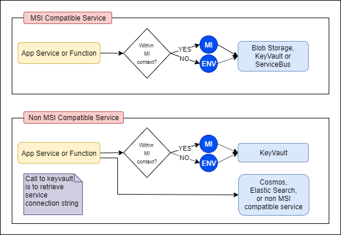

# OSDU R2 - Local Service Development

This session is intended to provide a closer look into the overall structure of the OSDU R2 services. The following topics are in scope:

- Introduction to service configuration and managed identity
- Introduction to the `os-core-lib-azure` components
- Introduction to the code structure of services that are *cloud agnostic*
- Introduction to the code structure of services that are not *cloud agnostic*

The accompanying [challenge](./04_LOCAL_SERVICE_DEVELOPMENT_CHALLENGE.md) will provide hands on experience building, debugging and testing OSDU R2 services locally.

The items in the list below are out of scope for this session:

- Deep dive into service business logic
- Deep dive into service APIs
- Introduction to [Spring](https://spring.io/why-spring) or [Spring Boot](https://spring.io/projects/spring-boot)
- Introduction to [Maven](https://maven.apache.org/)


## Service Configuration

OSDU R2 services leverage externalized configuration by using [Appliction Properties](https://docs.spring.io/spring-boot/docs/current/reference/html/spring-boot-features.html#boot-features-external-config-application-property-files). Here is an example of what some of these properties look like:

```
# in application.properties
azure.cosmosdb.database=${cosmosdb_database}
```

Logically, this enables applications to consume a property named `azure.cosmosdb.database` that has value equal to the `cosmosdb_database` environment variable. The value of `cosmosdb_database` will be set using [App Settings](https://docs.microsoft.com/en-us/azure/app-service/configure-common) when running in Azure and will be set using an environment variable when running locally.

This property can be injected into the application using the following piece of code:

```java
@Configuration
public class AzureBootstrapConfig {
    @Value("${azure.cosmosdb.database}")
    private String cosmosDBName;
}
```

## Managed Identity

Most (not all) of the OSDU R2 services leverages [Managed Identity](https://docs.microsoft.com/en-us/azure/active-directory/managed-identities-azure-resources/overview) to authenticate with Azure resources when running within the context of an App Service. The MI for the App Service instances have the appropriate role assignments that enable the deployed services to authenticate to Azure resources without using sensitive keys or connection strings in environment variables.

However, when running locally, it is necessary to provide the following environment variables in liu of Managed Identity (which does not run on your local machine):

- `AZURE_CLIENT_ID`
- `AZURE_TENANT_ID`
- `AZURE_CLIENT_SECRET`

Values that developers can use locally are provisioned as a part of the infrastructure deployment for this application. They are stored in KeyVault secrets (`app-dev-sp-username`, `app-dev-sp-password` and `app-dev-sp-tenant-id`). Where to find them in detail is described in more detail in each of the `README.md` files in the service repositories.


The following diagram illustrates the use of MI within the context of OSDU R2 services:



## Shared Azure Components - os-core-lib-azure

The `os-core-lib-azure` repository was created in an effort to reduce duplicate code across the Azure OSDU R2 implementation. The migration of duplicate Azure code into `os-core-lib-azure` is an ongoing effort as the services mature. Here is a brief package overview of the code that lives in `os-core-lib-azure` as of this document's writing.

| Package  | Description |
| ---      | ---         |
| `org.opengroup.osdu.azure` | Simplifies common operations against Azure services like Cosmos and KeyVault |
| `org.opengroup.osdu.azure.dependencies` | Unified Spring configuration of Azure service clients |
| `org.opengroup.osdu.common` | Common validation code |
| `org.opengroup.osdu.elastic.dependencies` | Azure implementation of Elasticsearch related dependencies used in `os-indexer-azure` and `os-search-azure` |

One of the benefits of centralizing the dependency configuration of Azure specific code is that it makes sweeping changes such as migrating services to use Managed Identity (over secrets configured in the environment) easier to implement once and re-use across the services.

**Note**: Keep in mind that the migration is in progress. Not all services are fully onboarded to use these dependencies, yet.

## Cloud Agnostic Services

As mentioned in the [Service Overview Document](./02_SERVICE_OVERVIEW.md) document, most of the OSDU R2 services are built in two parts: (1) `core`, which holds all of the business logic and (2) `provider`, which holds the cloud specific implementation of `Service Provider Interfaces`.

A condensed view of the service may look like the following:

```bash
$ tree -L 2 "os-$SERVICE"
os-$SERVICE
├── provider
│   └── $SERVICE-azure
├── pom.xml
├── $SERVICE-core
│   ├── pom.xml
└── testing
    ├── $SERVICE-test-azure
    └── $SERVICE-test-core
```

Here is, in general, how to build various project components

**Build core service and all providers**
```bash
$ cd "os-$SERVICE"
$ mvn clean install
```

**Build & run Azure service**
```bash
$ (cd "os-$SERVICE/$SERVICE-core" && mvn clean install)
$ cd "os-$SERVICE/provider/$SERVICE-azure"
$ mvn clean package
$ JAR_FILE="..." # actual jar name will change for each service and version. it will be somewhere in ./target
$ java -jar "$JAR_FILE"
```

**Build & run Azure integration tests**
```bash
$ (cd "os-$SERVICE/testing/$SERVICE-test-core" && mvn clean install)
$ cd "os-$SERVICE/testing/$SERVICE-test-azure"
$ mvn clean package
```

## Other Services

The local build, run and test steps for other services are similar. The details can be found in the `README.md` for each service.

## Next Steps

Now that you have gotten this far, you may want to try to run some of the services locally by following the [challenge](./04_LOCAL_SERVICE_DEVELOPMENT_CHALLENGE.md) document!

## License
Copyright © Microsoft Corporation
Licensed under the Apache License, Version 2.0 (the "License");
you may not use this file except in compliance with the License.
You may obtain a copy of the License at
[http://www.apache.org/licenses/LICENSE-2.0](http://www.apache.org/licenses/LICENSE-2.0)
Unless required by applicable law or agreed to in writing, software
distributed under the License is distributed on an "AS IS" BASIS,
WITHOUT WARRANTIES OR CONDITIONS OF ANY KIND, either express or implied.
See the License for the specific language governing permissions and
limitations under the License.
