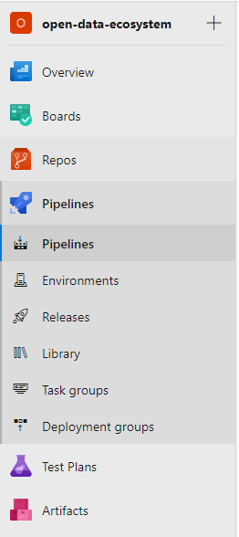
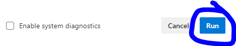
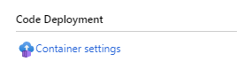

# Introduction

The purpose of this guide is to:

- Gain hands on experience deploying 3 out of 6 **OSDU R2 services** using the Azure Devops `yaml` pipelines
- Deploy **OSDU R2 services** to Azure infrastructure created from the **OSDU R2 [Infrastructure Deployment Walkthrough](./INFRASTRUCTURE_DEPLOYMENTS_CHALLENGE.md)**
- Learn to respect the order in which services depend on one another
- Gain confidence in using the **Generic Service Pipeline** to deploy 3 remaining **OSDU R2 services** as a stretch goal

This guide assumes that the reader has:

- Access to the Azure DevOps project [here](https://dev.azure.com/slb-des-ext-collaboration/open-data-ecosystem/)
- Generated a Personal Access Token (PAT) from Azure DevOps. See instructions [here](https://docs.microsoft.com/en-us/azure/devops/organizations/accounts/use-personal-access-tokens-to-authenticate?view=azure-devops&tabs=preview-page)
- Deployed an infrastructure pipeline stage from the **OSDU R2 [Infrastructure Deployment Walkthrough](./INFRASTRUCTURE_DEPLOYMENTS_CHALLENGE.md)**
- Experience with [Git](https://git-scm.com/downloads)
- Experience with [Pipelines in Azure DevOps](https://docs.microsoft.com/en-us/azure/devops/pipelines/get-started/key-pipelines-concepts?view=azure-devops)

This guide will utilize the software below:

- [Git](https://git-scm.com/)
- An IDE or text editor of your choice

> Note: Just getting started with **OSDU R2 service** deployments? You may want to read through the [Getting Started](./05_AZURE_SERVICE_DEPLOYMENT_GETTING_STARTED.md) guide first!

## Local Developer Tooling Set-Up

**Installing Dependencies**

If you do not have `Git` installed on your machine, you can follow the [installation](https://git-scm.com/book/en/v2/Getting-Started-Installing-Git) guide to configure it. If developing on Windows, it is recomended to develop using [WSL 2.0](https://docs.microsoft.com/en-us/windows/wsl/wsl2-install) because it will more closely match the CI/CD environment. However, this is a recommendation and not a requirement for the steps in this guide.

## Adding a new deployment stage

For this challenge, we will setup a new deployment stage for 3 out of 6 services. The expectation is that the build triggering the deployment is occurring on a **particular branch**. Deploying to a **new stage** prevents distrupting existing deployments. Deploying only on a **particular branch** is helpful to understand the power of the YAML templating language.

> Note: The order in which the services are deployed should be respected. We start with the `os-entitlements-azure` service in this challenge.  Visit the [service deployments](https://dev.azure.com/slb-des-ext-collaboration/open-data-ecosystem/_git/infrastructure-templates?path=%2Fdocs%2Fosdu%2FSERVICE_DEPLOYMENTS.md) documentation for more details.

### Step 1. Initial setup

There are several setup steps that need to take place before using either the **Generic Service Pipeline** or **Function App Service Pipeline** to deploy any of the **OSDU R2 services**. Complete these in the order that they appear.

1. **Ensure existance of an up and running infrastructure pipeline stage**

    We recommend completing the **OSDU R2 [Infrastructure Deployment Walkthrough](./03_INFRASTRUCTURE_DEPLOYMENTS_CHALLENGE.md)**. That walkthrough will leave you with an up and running stage that has the Azure infrastructure needed to host the deployed services. For this challenge, we used the running Azure infrastructure bound by both the `Infrastructure Pipeline Variables - testni` variable group and the `Infrastructure Pipeline Secrets - testni`. You should have both of your own.

2. **Choose a unique stage identifier**

    We recommend using the same unique identifier created from completing the **OSDU R2 [Infrastructure Deployment Walkthrough](./03_INFRASTRUCTURE_DEPLOYMENTS_CHALLENGE.md)**. For this challenge, we used `testni`.

3. **Create common variable groups**

    We need to configure variable groups that all services will share before tackling service specific groups in later steps. To do this, we need to create 2 new variable groups that target pipeline stages:

    >  If you want to understand these variable groups, please visit [Getting Started](./05_AZURE_SERVICE_DEPLOYMENT_GETTING_STARTED.md). For simplicity, you can try cloning the variable groups where `$ENV` is `devint` as they are already configured correctly.

    🔲 **`Azure Target Env Secrets - $ENV`** (i.e., `Azure Target Env Secrets - testni`) / (Note: Authorize Key Vault then click [+Add])

    - If permissions prevent authorization, ensure that you are in the correct Azure Devops permission groups for the open-data-ecosystem project.

    🔲 **`Azure Target Env - $ENV`** (i.e., `Azure Target Env - testni`)

    ✅ **`Azure Common Secrets`** (Completed for you)

    ✅ **`Azure - Common`** (Completed for you)

### Step 2. Deploy `os-entitlements-azure`

1. **Checkout a branch**

    Checkout a branch of the [os-entitlements-azure](https://dev.azure.com/slb-des-ext-collaboration/open-data-ecosystem/_git/os-entitlements-azure) repository

    > Note: You will likely need to configure your personal access token (PAT) in order to execute the `git pull`. Follow [these steps](https://docs.microsoft.com/en-us/azure/devops/organizations/accounts/use-personal-access-tokens-to-authenticate?view=azure-devops&tabs=preview-page#create-personal-access-tokens-to-authenticate-access) to create a PAT.

    ```bash
    # branch name should contain your unique identifier (to make cleanup easier)
    $ git checkout -b osdu-onboarding/testni
    ```

1. **Configure pipeline by modifying release**

    You will need to configure the pipeline located at `devops/service-pipeline.yml` to deploy under the conditions we set in the project. For the purposes of this walkthrough, you will only be adding a **new stage**. However, there are more stages. If you want to understand this file, please visit the [Getting Started](./05_AZURE_SERVICE_DEPLOYMENT_GETTING_STARTED.md) guide.

    - Ensure that the variable groups referenced in the file still live within the Azure Devops project by visiting the [variable groups](https://dev.azure.com/slb-des-ext-collaboration/open-data-ecosystem/_library?itemType=VariableGroups) page.
    - Ensure that the `yaml` file template paths in the file are still active by visiting the [infrastructure-templates](https://dev.azure.com/slb-des-ext-collaboration/open-data-ecosystem/_git/infrastructure-templates) repo.
    - Modify the file by adding a **new stage**.

    The modified file should look something like this:

    > Note: One very **important** thing to know about this. The `Build.SourceBranchName` variable is everything **after** the last `/` in your branch name. This can be confusing, but in the example it is just `testni` and not `osdu-onboarding/testni`.

    ```bash
    # abridged output
    $ cat -n devops/service-pipeline.yml
        44
        45  variables:
        46    - group: 'Azure Common Secrets'
        47    - group: 'Azure - Common'
        48
        49    - name: serviceName
        50      value: 'entitlements'
        51
        52  resources:
        53    repositories:
        54      - repository: infrastructure-templates
        55        type: git
        56        name: open-data-ecosystem/infrastructure-templates
        57
        58  stages:
        59    - template: devops/service-pipelines/build-stage.yml@infrastructure-templates
        60      parameters:
        --        ...
        69    - template: devops/service-pipelines/deploy-stages.yml@infrastructure-templates
        70      parameters:
        71        serviceName: ${{ variables.serviceName }}
        72        providers:
        73          -  name: Azure
        74            # Merges into Master
        75             ${{ if eq(variables['Build.SourceBranchName'], 'master') }}:
        76               environments: ['devint', 'qa', 'prod']

        77            # PR updates /creations
        78             ${{ if eq(variables['Build.SourceBranchName'], 'testni') }}:     # note the branch check is against testni, not osdu-onboarding/testni
        79               environments: ['testni']                                       # your identifier goes here!

        80            # PR updates / creations
        81             ${{ if ne(variables['Build.SourceBranchName'], 'testni') }}:     # there is a change here as well
        82               environments: ['devint']
    ```

1. **Commit your code**

    ```bash
    $ git add devops/
    $ git commit -m "Configuring new stage for OSDU onboarding training"
    $ git push --set-upstream origin $(git branch --show-current)
    ```

1. **Create the service variable group**

    We need to configure the `Azure Service Release - entitlements` variable group for the `os-entitlements-azure` service release. This group holds values which are eventually passed to a [maven task](https://docs.microsoft.com/en-us/azure/devops/pipelines/tasks/build/maven?view=azure-devops) for deployment and integration tests. At the time of this walkthrough, the variable group is already present.

    Values for the `Azure Service Release - entitlements` variable group are slightly different than the other services. It should look something like this:

    > Note: The values of this variable group currently depend on values from the `Azure Common Secrets` and `Azure - Common` groups. This is a great opportunity to double check those values as they decide which Azure tenant, subscription and resource groups the deployment is targeting.

    | name | value |
    | ---  | ---   |
    | `MAVEN_DEPLOY_GOALS` | ex `azure-webapp:deploy` |
    | `MAVEN_DEPLOY_OPTIONS` | ex `--settings $(System.DefaultWorkingDirectory)/drop/maven/settings.xml -DVSTS_FEED_TOKEN=$(VSTS_FEED_TOKEN) -DAZURE_DEPLOY_TENANT=$(AZURE_DEPLOY_TENANT) -DAZURE_DEPLOY_CLIENT_ID=$(AZURE_DEPLOY_CLIENT_ID) -DAZURE_DEPLOY_CLIENT_SECRET=$(AZURE_DEPLOY_CLIENT_SECRET) -Dazure.appservice.resourcegroup=$(AZURE_DEPLOY_RESOURCE_GROUP) -Dazure.appservice.plan=$(AZURE_DEPLOY_APPSERVICE_PLAN) -Dazure.appservice.appname=$(AZURE_ENTITLEMENTS_SERVICE_NAME) -Dazure.appservice.subscription=$(AZURE_DEPLOY_SUBSCRIPTION)` |
    | `MAVEN_DEPLOY_POM_FILE_PATH` | ex `drop` |
    | `MAVEN_INTEGRATION_TEST_OPTIONS` | ex `--settings $(System.DefaultWorkingDirectory)/drop/deploy/integration-tests/maven/settings.xml -DVSTS_FEED_TOKEN=$(VSTS_FEED_TOKEN) -DDOMAIN=$(DOMAIN) -DENTITLEMENT_URL=$(ENTITLEMENT_URL) -DENTITLEMENT_APP_KEY=$(entitlement-key) -DMY_TENANT=$(MY_TENANT) -DINTEGRATION_TESTER=$(INTEGRATION_TESTER) -DAZURE_TESTER_SERVICEPRINCIPAL_SECRET=$(AZURE_TESTER_SERVICEPRINCIPAL_SECRET) -DAZURE_AD_TENANT_ID=$(AZURE_DEPLOY_TENANT) -DAZURE_AD_APP_RESOURCE_ID=$(AZURE_AD_APP_RESOURCE_ID) -DAZURE_AD_OTHER_APP_RESOURCE_ID=$(AZURE_AD_OTHER_APP_RESOURCE_ID) -DEXPIRED_TOKEN=$(EXPIRED_TOKEN)  -DENTITLEMENT_MEMBER_NAME_VALID=$(INTEGRATION_TESTER) -DENTITLEMENT_MEMBER_NAME_INVALID=InvalidTestAdmin -DENTITLEMENT_GROUP_NAME_VALID=integ.test.data.creator` |
    | `MAVEN_INTEGRATION_TEST_POM_FILE_PATH` | ex `drop/deploy/integration-tests` |
    | `SERVICE_RESOURCE_NAME` | ex: `$(AZURE_ENTITLEMENTS_SERVICE_NAME)` |

1. **Seed Test Data**

    The following documents will need to be seeded into a CosmosDB Collection in order for the integration tests to run and can be found in the [infrastructure-templates](https://dev.azure.com/slb-des-ext-collaboration/open-data-ecosystem/_git/infrastructure-templates?path=%2Fdocs%2Fosdu):

    | Cosmos Account | Cosmos Database | Cosmos Collection | Document | Reason | Notes |
    | ---            | ---             | ---               | ---      | --- |---   |
    | *stage-specific* | `dev-osdu-r2-db` | `TenantInfo` | `./integration-test-data/tenant_info_1.json` | Entitlements Service Integration Tests | Replace `$SERVICE_PRINCIPAL_ID` with the value of `app-dev-sp-username` from the variable groups |
    | *stage-specific* | `dev-osdu-r2-db` | `TenantInfo` | `./integration-test-data/tenant_info_2.json` | Entitlements Service Integration Tests  | Replace `$SERVICE_PRINCIPAL_ID` with the value of `app-dev-sp-username` from the variable groups |
    | *stage-specific* | `dev-osdu-r2-db` | `UserInfo` | `./integration-test-data/user_info_1.json` | Entitlements Service Integration Tests  | Replace `$SERVICE_PRINCIPAL_ID` with the value of `app-dev-sp-username` from the variable groups |

    **Navigate to the Azure Cloud portal**
    - Search for `Azure Cosmos DB`

        

    - Select the Cosmosdb from your infrastructure deployment. We used `ado-testni-s-sp63ur2a-cosmosdb`. Your will be different.

    - Search [here](https://dev.azure.com/slb-des-ext-collaboration/open-data-ecosystem/_git/infrastructure-templates?path=%2Fdocs%2Fosdu%2Fintegration-test-data) to find the 3 json documents listed in the above table and use them to seed test data for the appropriate cosmos collection. The variable `app-dev-sp-username` can be found in the `Azure Target Env Secrets - $ENV` group created earlier. The values for that variable can be found in the key vault account created from the new deployment stage of the [Infrastructure Deployment Walkthrough](./03_INFRASTRUCTURE_DEPLOYMENTS_CHALLENGE.md). From the Azure Cloud portal, you can either navigate to the appropriate key vault account to find the values or grab them directly from the state file dedicated to the new infrastructure deployment stage.

        

        **Shortcut** If your local environment has the azure cli, the following command can be useful to pull secrets from keyvault:
        ```bash
        az keyvault secret show --vault-name $KEY_VAULT_NAME --name app-dev-sp-username --query value -otsv
        ```

1. **Trigger a deployment**

    Now we can finally trigger a deployment. :) We expect this to work because earlier steps ensured that we are targeting running infrastructure through the appropriate variable groups. We also configured a new deployment stage using `yaml`, variable groups and seeded test data.

    **Navigate to the correct pipeline**
    - Select `Pipelines` pane in Azure DevOps

        

    - View `All` and open the `Azure` folder. Select the `os-entitlements-azure` pipeline

        

    - Select `Run pipeline`

        

    - Select the correct branch

        

    - Click `Run`

        

1. **Validate deployment**

    Before calling the deployment a success, we have to validate that the pipeline ran successfully and deployed the `os-entitlements-azure` service to the appropriate infrastructure in Azure.

    - **Trail the pipeline**

        We can can begin the validation process by watching the pipeline run and checking for success. Visit the [Recently run pipelines](https://dev.azure.com/slb-des-ext-collaboration/open-data-ecosystem/_build) page and then select `os-entitlements-azure` from the list. You'll see a list of recent pipeline runs. Once you select yours, you should see the following interactive workflow displayed:

        

    - **Navigate to the Azure Cloud portal**
        - Search for `App Services`

            

        - Select the `os-entitlements-azure` service from your infrastructure deployment. We used `ado-testni-s-sp63ur2a-au-entitlements`. Yours will be different.

        - Click the URL displayed in the `overview` panel

            

        - If the service presents a swagger interface, consider this service officially deployed.

            

### Step 3. Deploy `os-legal`

1. **Checkout a branch**

    Checkout a branch of the [os-legal](https://dev.azure.com/slb-des-ext-collaboration/open-data-ecosystem/_git/os-legal) repository

    ```bash
    # branch name should contain your unique identifier (to make cleanup easier)
    $ git checkout -b osdu-onboarding/testni
    ```

1. **Configure pipeline by modifying release**

    You will need to configure the pipeline located at `devops/service-pipeline.yml` to deploy under the conditions we set in the project. For the purposes of this walkthrough, you will only be adding a **new stage**. However, there are more stages. If you want to understand this file, please visit the [Getting Started](./05_AZURE_SERVICE_DEPLOYMENT_GETTING_STARTED.md) guide.

    > Note: Please refer to first deployment of this documentation for instructions on how to perform this step.

1. **Commit your code**

    ```bash
    $ git add devops/
    $ git commit -m "Configuring new stage for OSDU onboarding training"
    $ git push --set-upstream origin $(git branch --show-current)
    ```

1. **Create the service variable group**

   The variable group `Azure Service Release - legal` for the `os-legal-azure` service pipeline is already present. However, this is a great opportunity to double check the values as they decide which Azure tenant, subscription and resource groups the deployment is targeting.

1. **Seed Test Data**

    > Note: Please refer to first deployment of this documentation for instructions on how to perform this step.

1. **Trigger a deployment**

    > Note: Please refer to first deployment of this documentation for instructions on how to perform this step.

1. **Validate deployment**

    Before calling the deployment a success, we have to validate that the pipeline ran successfully and deployed the `os-legal` service to the appropriate infrastructure in Azure.

    - **Trail the pipeline**

        We can can begin the validation process by watching the pipeline run and checking for success. Visit the [Recently run pipelines](https://dev.azure.com/slb-des-ext-collaboration/open-data-ecosystem/_build) page and then select `os-legal-azure` from the list. You should see the following interactive workflow displayed:

        

    - **Navigate to the Azure Cloud portal**
        - Search for `App Services`

            

        - Select the `os-legal` service from your infrastructure deployment. In our case, it's `ado-testni-s-sp63ur2a-au-legal`

        - Select the URL displayed in the overview panel

            

        - If the below is displayed, consider this service officially deployed.

            

### Step 4. Deploy `os-indexer-queue`

1. **Checkout a branch**

    Checkout a branch of the [os-indexer-queue](https://dev.azure.com/slb-des-ext-collaboration/open-data-ecosystem/_git/os-indexer-queue) repo

    ```bash
    # branch name should contain your unique identifier (to make cleanup easier)
    $ git checkout -b osdu-onboarding/testni
    ```

1. **Configure pipeline by modifying release**

    You will need to configure the pipeline located at `indexer-queue-azure-enqueue/azure-pipelines.yml` to deploy under the conditions we set in the project. For the purposes of this walkthrough, you will only be adding a **new stage**. However, there are more stages. If you want to understand this file, please visit the [Getting Started](./05_AZURE_SERVICE_DEPLOYMENT_GETTING_STARTED.md) guide.

    - Ensure that the `yaml` file template path in the file is still active within the `os-indexer-queue` repo.
    - Modify the file by adding a **new stage**.

    The modified file should look something like this:

    ```bash
    # abridged output
    $ cat -n indexer-queue-azure-enqueue/azure-pipelines.yml
        15  # Required Group Variables
        16    # VSTS_FEED_TOKEN
        17    # CONTAINER_REGISTRY_NAME
        18    # SERVICE_CONNECTION_NAME
        19    # RESOURCE_GROUP_NAME
        20    # FUNCTION_APP_NAME
        21    # AGENT_POOL
        22
        --    ..
        52
        53  variables:
        54  - group: 'Azure Common Secrets'
        55  - group: 'Azure - Common'
        56
        57  - name: MAVEN_SETTINGS      # Relative path to the settings.xml file.
        58    value: './indexer-queue-azure-enqueue/maven/settings.xml'
        59
        60  - name: DOCKERFILE          # Relative path to the Docker File.
        61    value: './indexer-queue-azure-enqueue/Dockerfile'
        62
        63  - name: POM_FILE            # Relative path to the POM File.
        64    value: './indexer-queue-azure-enqueue/pom.xml'
        65
        66  - name: IMAGE_NAME         # Determines name of the Docker Image
        67    value: 'indexer-enqueue'
        68
        69  stages:
        70  - template: pipelines/stages.yml
        71    parameters:
        72      environments:
        73      - ${{ if ne(variables['Build.SourceBranchName'], 'testni') }}:
        74        - name: 'devint'
        75
        76      - ${{ if eq(variables['Build.SourceBranchName'], 'testni') }}:
        77        - name: 'testni'
        78
        79      - ${{ if eq(variables['Build.SourceBranchName'], 'master') }}:
        80        - name: 'qa'
        81        - name: 'prod'
    ```

1. **Commit your code**

    ```bash
    $ git add indexer-queue-azure-enqueue/
    $ git commit -m "Configuring new stage for OSDU onboarding training"
    $ git push --set-upstream origin $(git branch --show-current)
    ```

1. **Create the service variable group**

    This service currently does not have a dedicated variable group.

1. **Seed Test Data**

    This service currently does not have existing integration tests.

1. **Trigger a deployment**

    Now we can finally trigger a deployment. :) We expect this to work because earlier steps ensured that we are targeting running infrastructure through the appropriate variable groups. We also configured a **new stage** using `yaml` and variable groups. The pipeline to trigger is currently named `os-indexer-enqueue-azure` and is hosted in the Azure folder.

1. **Validate deployment**

    Before calling the deployment a success, we have to validate that the pipeline ran successfully and deployed the `os-indexer-queue` service to the appropriate infrastructure in Azure.

    - **Trail the pipeline**

        We can can begin the validation process by watching the pipeline run and checking for success. Visit the [Recently run pipelines](https://dev.azure.com/slb-des-ext-collaboration/open-data-ecosystem/_build) page and then select `os-indexer-enqueue-azure` from the list. You'll see a list of recent pipeline runs. Once you select yours, you should see the following interactive workflow displayed:

        

    - **Navigate to the Azure Cloud portal**
        - Search for `App Services`

            

        - Select the `os-indexer-enqueue-azure` service from your infrastructure deployment. We used `ado-testni-s-sp63ur2a-enque`. Yours will be different.

        - Select the `Platform features` tab

            

        - Click the `Container settings` link

            

        - If container logs indicate a successfull deployment, consider this service officially deployed.

            

### Celebrate

Congratualations! You've successfully gained hands on experience with Azure Devops `yaml` pipelines by using both the **Generic Service Pipeline** and **Function App Service Pipeline** to deploy 3 out of 6 **OSDU R2 services**. Now, take that experience with you to complete the below stretch goal. It's one of many ways to celebrate! ;)

### Stretch Goal

Good "extra credit" work would be to deploy the remainder of the services.

- `os-storage`
- `os-search`
- `os-indexer`

## License

Copyright © Microsoft Corporation
Licensed under the Apache License, Version 2.0 (the "License");
you may not use this file except in compliance with the License.
You may obtain a copy of the License at 
[http://www.apache.org/licenses/LICENSE-2.0](http://www.apache.org/licenses/LICENSE-2.0)
Unless required by applicable law or agreed to in writing, software
distributed under the License is distributed on an "AS IS" BASIS,
WITHOUT WARRANTIES OR CONDITIONS OF ANY KIND, either express or implied.
See the License for the specific language governing permissions and
limitations under the License.
