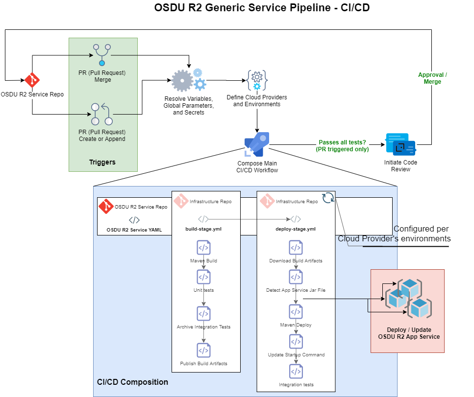
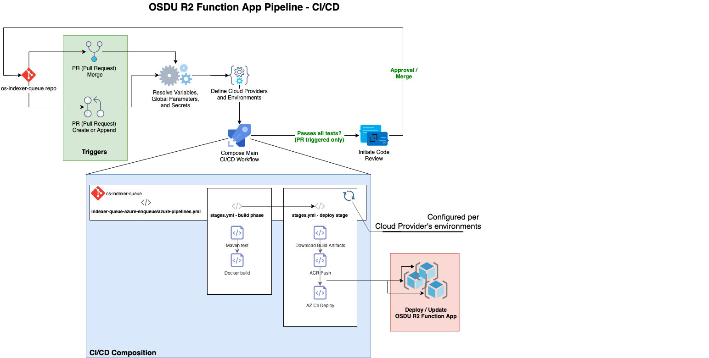

# OSDU R2 Service Deployments

This session is intended to provide a closer look into how the **OSDU R2 services** in Azure are tested and deployed. The accompanying [challenge](./05_AZURE_SERVICE_DEPLOYMENT_CHALLENGE.md) will provide hands on experience with the **OSDU R2 Generic Service Pipeline**.

The following topics are in scope:

- Introduction to `yaml` pipelines in Azure DevOps
- Introduction to the **OSDU R2 Generic Service Pipeline** in Azure DevOps
- Introduction to the **OSDU R2 Function App Service Pipeline** in Azure Devops

The items in the list below are out of scope for this session:

- Overview of **OSDU R2 services**
- How to interact with a running **OSDU R2 service**
- Deep dive on **OSDU R2 services** and how they interact with one another
- Deploying **OSDU R2 services** from your local developer workstation

## Prerequisites

- Experience with [Azure Pipelines](https://docs.microsoft.com/en-us/azure/devops/pipelines/get-started/key-pipelines-concepts?view=azure-devops)
- Familiar with the term “Continuous Integration / Continuous Deployment” ( **CI/CD** )

## An introduction to YAML based pipelines

An Azure Devops **YAML Pipeline** uses the `yaml` language to offer a common language framework for accelerating pipeline automation through file configurations. A **YAML Pipeline** grants developers the ability to define Pipeline **Triggers**, **Stages**, **Jobs** and more in a unified language. The **Generic Service Pipeline** described in the next section uses the **YAML Template** sub-feature offered by Azure Devops in order to orchestrate full pipelines. A **YAML Template** is a YAML file that depends on another YAML file for execution. Dependencies are expressed by explicitly referencing other YAML files. This dependency chain grants developers the ability to modularize their entire pipeline configuration for automated deployments. **OSDU R2 services** take full advantage of **Generic Service Pipeline**.

- [More on YAML templates](https://docs.microsoft.com/en-us/azure/devops/pipelines/yaml-schema?view=azure-devops&tabs=schema%2Cparameter-schema)

## What is the Generic Service Pipeline?

In order to further simplify **CI/CD** configurations for **OSDU R2 services**, common **CI/CD** operations have been abstracted away into a build `yaml` file and release `yaml` file. These two files orchestrate the **Generic Service Pipeline**. The pipeline executes most of the **CI/CD** workflow for all **OSDU R2 services** by exposing input parameters that services can use to pass context. The pipeline then passes values to other `yaml` files. Passing values from one `yaml` file to another is achieved by taking full advantage of the Azure Devops `yaml` templating feature. In our implementation, the **Generic Service Pipeline** is hosted in the infrastructure repo but the clients that it serves each live in their own respective repos. In conclusion, the **Generic Service Pipeline** holds enough intelligence to service all **OSDU R2 services** except function app services. The **Function App Service Pipeline** overview section has more details.

- ### OSDU R2 Generic Service Pipeline

    An overview of the **OSDU R2 Generic Service Pipeline** Workflow

    

- ### YAML features

    - **[build-stage.yml](https://dev.azure.com/slb-des-ext-collaboration/open-data-ecosystem/_git/infrastructure-templates?path=%2Fdevops%2Fservice-pipelines%2Fbuild-stage.yml)**

        The `build_stage.yml` validates that the service can build by consuming values passed directly to it from an **OSDU R2 service** `yaml` file. Each service hosts its own `yaml` file and is responsible for passing the correct values.

        | primary features | build stage file | behavior |
        | ---  | ---   | ---  |
        | [Maven Build](https://docs.microsoft.com/en-us/azure/devops/pipelines/tasks/build/maven?view=azure-devops) | `build_stage.yml` | Build application components using maven tasks. |
        | Unit Tests | `build_stage.yml` | Automatically detects and runs unit tests using maven tasks. |
        | Archive Integration tests | `build_stage.yml` | Zips integration tests. |

    - **[deploy-stages.yml](https://dev.azure.com/slb-des-ext-collaboration/open-data-ecosystem/_git/infrastructure-templates?path=%2Fdevops%2Fservice-pipelines%2Fdeploy-stages.yml)**

        Per cloud provider, the `deploy-stage.yml` executes a set of tasks for every environment passed to it from an **OSDU R2 service** `yaml` file. The final task in this file runs integration tests.

        | primary features | deploy stage file | behavior |
        | ---  | ---   | ---  |
        | Cloud Based Deployments | `deploy-stage.yml` | This file enables the deploy steps to run per cloud vendor. Currently, only Azure is taking advantage of this feature. |
        | Environment Based Deployments  | `deploy-stage.yml` | This file enables the deploy steps to run per cloud provider's list of environments. |
        | Detect App Service Jar File | `app-service-detect-jar.yml` | Scans the incoming artifact drop folder for the jar file. |
        | [Maven Deploy](https://docs.microsoft.com/en-us/azure/devops/pipelines/tasks/build/maven?view=azure-devops) | `app-service-deployment-steps.yml` | Deploy application using maven tasks. |
        | App Service CL Update | `app-service-update-commandline.yml` | Updates the App Service startup command with information about the newly deployed JAR file. |
        | Integration Tests | `app-service-deployment-steps.yml` | Automatically detects and runs integration tests using maven tasks. |

- ### [Pipeline variable groups](https://dev.azure.com/slb-des-ext-collaboration/open-data-ecosystem/_library?itemType=VariableGroups)

    Variable groups are named in a way that allows the pipeline to infer rather or not the group belongs to a specific cloud provider and for which stage should the group be used for. More details about the values of these variable groups are described [here](https://dev.azure.com/slb-des-ext-collaboration/open-data-ecosystem/_git/infrastructure-templates?path=%2Fdocs%2Fosdu%2FSERVICE_DEPLOYMENTS.md&_a=preview).

    1. **`Azure Target Env Secrets - $ENV`** (i.e., `Azure Target Env Secrets - devint`)

        This group holds the key vault `secret names` **OSDU R2 services** will use to access key vault `secret values` held within a single key vault account. In this walkthrough, you'll only create one of these groups but there are several for the pipeline. (`devint`, `qa`, `prod`, etc...) The Azure Service Principal used to deploy the infrastructure must be granted Key Management Operations.

    2. **`Azure Target Env - $ENV`** (i.e., `Azure Target Env - devint`)

        This group holds the values that are reflected in the naming conventions of all Azure Infrastructure resource names. The source of these values can be found in the Terraform workspace state file created from the new deployment stage of the [Infrastructure Deployment Walkthrough](./03_INFRASTRUCTURE_DEPLOYMENTS_CHALLENGE.md). They can also be found in the key vault account referenced in the state file, in this case, it would be the state file and key vault account for the `devint` stage.

    3. **`Azure Common Secrets`**

        This group holds values within a single key vault account for all stages of the pipeline. This key vault account must be created manually. The infrastructure deployment does not create this key vault account.

    4. **`Azure - Common`**

        This group depends on all the above mentioned variable groups. It also holds the majority of variables needed to deploy **OSDU R2 services**.

    5. **`Azure Service Release - $SERVICE`**

        This group holds context about specific service's repo structure as well as data for running service specific integration tests upon release. Out of the 6 services, `os-indexer-queue` does not use this. To read more about repo structures, visit the [Service Overview](./02_Service_Overview).

- ### Variable group naming conventions

    Variable group naming conventions should be respected. They are hardcoded in the following `yaml` files. [Challenge](./05_AZURE_SERVICE_DEPLOYMENT_CHALLENGE.md) to be completed also assumes that the variable group naming conventions are respected. If ever attempting to rename variable groups, understand the consequences by starting here:

    | Variable Group | YAML FILE |
    | ---      | ---         |
    |  `Azure - Common` | Service yaml |
    |  `Azure Common Secrets` | Service yaml |
    |  `Azure - Common` | deploy-stages.yml |
    |  `Azure Common Secrets` | deploy-stages.yml |
    |  `${{ provider.name }} Target Env - ${{ environment }}` | deploy-stages.yml |
    |  `${{ provider.name }} Target Env Secrets - ${{ environment }}` | deploy-stages.yml |
    |  `${{ provider.name }} Service Release - ${{ parameters.serviceName }}` | deploy-stages.yml |

- ### Cloud provider boundaries

    The **Generic Service Pipeline** currently accomodates multi-cloud deployments. However, only Azure has an implementation that has taken advantage of the flexibility that the pipeline offers. Currently, 5 out of 6 services support multi-cloud scenarios so most services are capable of passing in context for multiple cloud providers to the pipeline. The one service that is not multi-cloud ready at the moment is [os-entitlements-azure](https://dev.azure.com/slb-des-ext-collaboration/open-data-ecosystem/_git/os-entitlements-azure), however, it still relies on this pipeline. In short, deployments to a cloud provider are bound by their `yaml` pipeline configuration, the variable groups that belong to them and whether or not the **OSDU R2 service** solution includes that cloud provider's implementation.

## What is the Function App Service Pipeline?

In order to further simplify **CI/CD** configurations for the **OSDU R2 services**, an Azure bound pipeline was built for the [os-indexer-queue](https://dev.azure.com/slb-des-ext-collaboration/open-data-ecosystem/_git/os-indexer-queue) service.

- ### OSDU R2 Function App Service Pipeline

    An overview of the **OSDU R2 Function App Service Pipeline** Workflow

    

- ### YAML features

    - **[maven-test.yml](https://dev.azure.com/slb-des-ext-collaboration/open-data-ecosystem/_git/os-indexer-queue?path=%2Findexer-queue-azure-enqueue%2Fpipelines%2Ftasks%2Fmaven-test.yml)**

        The `maven-test.yml` template will execute all *unit* tests in the Azure Function codebase. Results will be published to Azure DevOps. **Note** there are not currently any integration tests for this service.

    - **[docker-build.yml](https://dev.azure.com/slb-des-ext-collaboration/open-data-ecosystem/_git/os-indexer-queue?path=%2Findexer-queue-azure-enqueue%2Fpipelines%2Ftasks%2Fdocker-build.yml)**

        The `docker-build.yml` template will build the service using the packaged `Dockerfile` and save it as a `.tar` file. This artifact is uploaded to Azure DevOps.

    - **[acr-push.yml](https://dev.azure.com/slb-des-ext-collaboration/open-data-ecosystem/_git/os-indexer-queue?path=%2Findexer-queue-azure-enqueue%2Fpipelines%2Ftasks%2Facr-push.yml)**

        The `acr-push.yml` template will consume the uploaded `.tar` file and push it to the correct ACR. The ACR is referenced through the environment variables and can be configured to either be shared across all stages or vary per stage. As of 4/7/2020, a unique ACR is built per stage.

    - **[function-deploy.ym](https://dev.azure.com/slb-des-ext-collaboration/open-data-ecosystem/_git/os-indexer-queue?path=%2Findexer-queue-azure-enqueue%2Fpipelines%2Ftasks%2Ffunction-deploy.yml)**

        The `function-deploy.yml` template updates the function to use the newly pushed image by using the `az functionapp config container set` command.

- ### Pipeline variable groups

    The variable groups used for the Azure Function are a subset of those used by other services and so the descriptions will not be duplicated here. The Azure Function pipeline depends on the following:

    - **`Azure Common Secrets`**
    - **`Azure - Common`**
    - **`Azure Target Env - $ENV`** (i.e., `Azure Target Env - devint`)

- ### Cloud Provider Boundaries

    Even though the [os-indexer-queue](https://dev.azure.com/slb-des-ext-collaboration/open-data-ecosystem/_git/os-indexer-queue) service is a multi-cloud service, the **Function App Service Pipeline** built for this service currently does not accomodate multi-cloud deployments. Currently, this pipeline is Azure cloud bound.

## PR vs Master builds in AzDO

The environments deployed to for pull requests differ from master. This prevents low quality deployments from releasing into customer facing environments.

| Environment | Deployed to for Pull Request? | Deployed to for Master? |
| --- | --- | --- |
| `devint` | yes | yes |
| `qa` | no | yes |
| `prod` | no | yes |

This behavior is controlled by the YAML templates that define the build and release process for the services. All service pipelines follow this behavior.

## Next Steps

Now that you have gotten this far, you may want to try deploying some of the services to Azure cloud by following the [challenge](./05_AZURE_SERVICE_DEPLOYMENT_CHALLENGE.md) document!

## License

Copyright © Microsoft Corporation
Licensed under the Apache License, Version 2.0 (the "License");
you may not use this file except in compliance with the License.
You may obtain a copy of the License at 
[http://www.apache.org/licenses/LICENSE-2.0](http://www.apache.org/licenses/LICENSE-2.0)
Unless required by applicable law or agreed to in writing, software
distributed under the License is distributed on an "AS IS" BASIS,
WITHOUT WARRANTIES OR CONDITIONS OF ANY KIND, either express or implied.
See the License for the specific language governing permissions and
limitations under the License.
