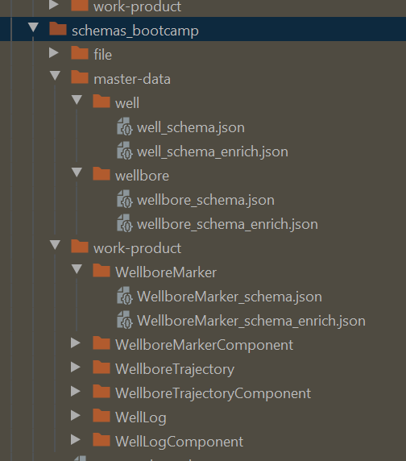
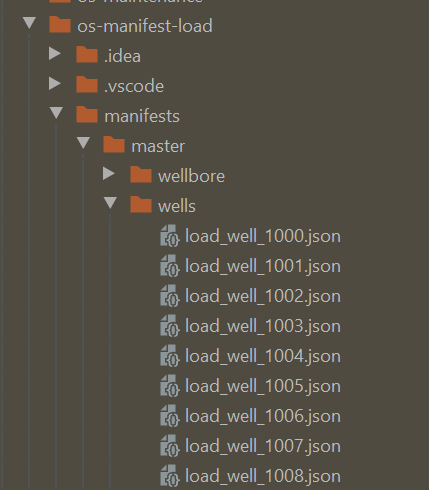

# Loading test Well Data into an OSDU R2 instance

#### What is metadata loading and why must we do it?

For the purposes of loading test Well Data, this content is constrained:
- Transferring Oil & Gas Well-related metadata, including information about the well location, under-gound/-sea well bore charateristics, topological details, and more.
- How such metadata is prepared for load into an Azure OSDU R2 instance (as the time of this writing)
- How specific Azure resources are are prepared before loading, or reloading, test metadata
- Where to find key artifacts, scripts, and metadata


#### What types of metadata is loaded into the system?

These are the types of metadata that concerns Well Data. This doesn't cover creating users, tenants, legal tags, etc.

- Schema
- Well Master Data
- Well Bore Master Data
- Well Log Data
- Well Trajectory Data
- Well Formation Top Data
- Enriched versions of the above (via transformation)

_Typical schema toplogy, as of this writing._



A step, described later, will perform the insertion of these schema records into the system.

#### What is the current solution for metadata loading?

As of this writing (April, 2020) there are many related scripts that are under rapid development.

I can only recommend to the reader that one pays attention to the following repositories (especially activity
on and off of the `master` branches) to stay on top of what's changing, and who the key author contributors
are to approach for advice and questions.

* `os-manifest-load`
* `opendes-osdu-test-data`

These repositories are being migrated, and their locations may change.

In generally, there are a set of python scripts, Postman collections, and REST Client (a VSCode extension) that
one can employ to aide with loading metadata, and validating the metadata is loaded.

##### Static Source Data (already in blob storage)

While this data loading topic primarily focuses no getting critical metadata loaded & ready, that metadata has pointers
to source data files. For example, the metadata for a given Well Log will reveal information about the location and
ownership of the well and the company that performed the measurements, but it will have a pointer to the actual
well log data file, too.

The source data files needs to be loading in Azure blob storage, and their location understood, so that the
metadata payloads can be updated.

##### Static manifest and work-product 'Storage Record' payload fragments

With the source data inplace, the metadata can up rewritten. There are thousands of these file, in many directories.

_Typical metadata json files, as of this writing._



The links within the metadata payloads which point to the to those file must be updated to be accurate.

_Typical Well Log metadata payload, as of this writing. Note the `PreLoadFilePath` key._

```json
    "Files": [
        {
            "ResourceTypeID": "srn:type:file/las2:",
            "ResourceSecurityClassification": "srn:reference-data/ResourceSecurityClassification:RESTRICTED:",
            "Data": {
                "GroupTypeProperties": {
                    "FileSource": "",
                    "PreLoadFilePath": "https://azglobalosdutestlake.blob.core.windows.net/tno/data/well-logs/1013_akm11_1978_comp.las"
                },
                "IndividualTypeProperties": {},
                "ExtensionProperties": {}
            },
            "AssociativeID": "f-1"
        }
    ]
}
```

To help with modifying all of the payloads more easily and quickly,
I've been commending the use of simple shell script to rewrite the links. Here's an example:
```bash
find . \
    -name '*.json' \
    -exec sed -i -e 's/azglobalosdulake/azglobalosdutestlake/g' {} \;
```

##### Run the utility scripts that:

The aforementioned python, nodejs, and REST Client scripts handle the rest of the load. They are
under rapid development, being changed frequently, and new scripts are showing up to replace
older ones.

In general, the scripts are used to carry out the following actions:

###### Prepare destination Azure resources

Scripting exists to wipe-out previous metadata loads. These are handy when data load bugs occur. Such a script
would nominally erase prevoiusly loaded Schema, Storage Records, certain blob collections that house metadata,
and erase Elastic Search indices.

###### PUT Schema

Scripts exist to automatically PUT all of the Schema into the system. These scripts handle the complexity
of properly formatting the PUT payloads (e.g. dealing with version identifiers, tenant IDs / data partion IDs,
and ensuring that both older R1 and newer R2 schemas are dealt with).

###### Construct and PUT well-formed Storage Records

A key script `dataload.py` performs the labor of actually reading every json file, and truly forming a correct
Storage Record payload for the Storage Service to consume, and then batch uploading those payloads to an instance
of the system. One critical thing it does is to map the kind of metadata being uploaded to the precise Schema/Kind ID.

In my work with the overall process, I've found that metadata should be loaded by this script in the following order:

1. Wells
1. Well Bores
1. Well Logs
1. Well Trajectories
1. Well Formation Tops

Also, this script generates a log file which the following step will require as input.

_Key tip: note that `dataload.py` reads target information from an adjacent `dataload.ini` file, which must be
correctly populated before using the script._

###### Enrich previously uploaded metadata that is conformant to OSDU R1 schema into it's OSDU R2 schema variant

After `dataload` is finished, the last upload step is to transform the R1-style metadata into the R2-style. The script
`enrichment.py` tackles this chore. It consumes logs from the previous script.

###### Help metadata loading workers to spot-check and test OSDU R2 services

To aide someone with loading metadata, several scripts exist in the repositories. These script make it simpler
to read metadata from a system (even while a load is in progress), gain clickable signed links to Source Data,
and to check total counts of records loaded against expected counts.

#### Briefly, what is the long term solution for data loading?

The Ingest Service and the general facility of services surrounding it would normally be used to load
data into an instance. We won't discuss it here, but you can find out more information on the
[Ingest and Enrichment wiki page](update to GitLab location /Ingestion-and-Enrichment-Detail.)

## License
Copyright © Microsoft Corporation
Licensed under the Apache License, Version 2.0 (the "License");
you may not use this file except in compliance with the License.
You may obtain a copy of the License at 
[http://www.apache.org/licenses/LICENSE-2.0](http://www.apache.org/licenses/LICENSE-2.0)
Unless required by applicable law or agreed to in writing, software
distributed under the License is distributed on an "AS IS" BASIS,
WITHOUT WARRANTIES OR CONDITIONS OF ANY KIND, either express or implied.
See the License for the specific language governing permissions and
limitations under the License.
